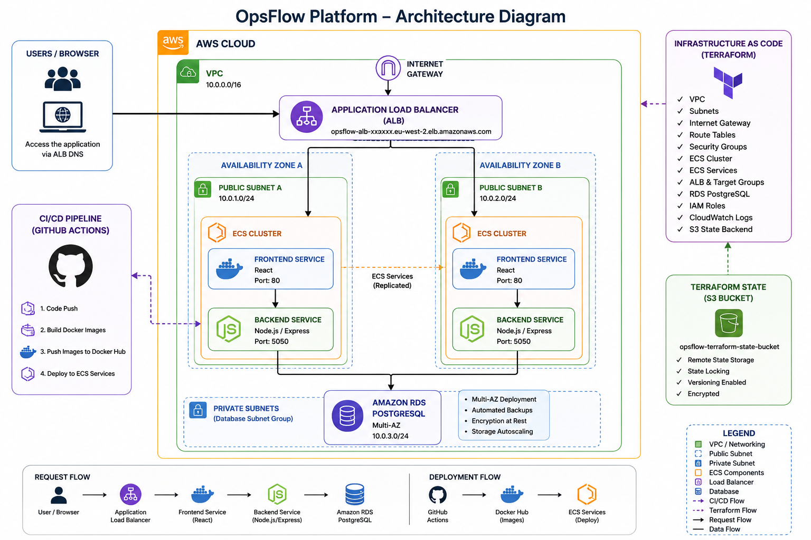
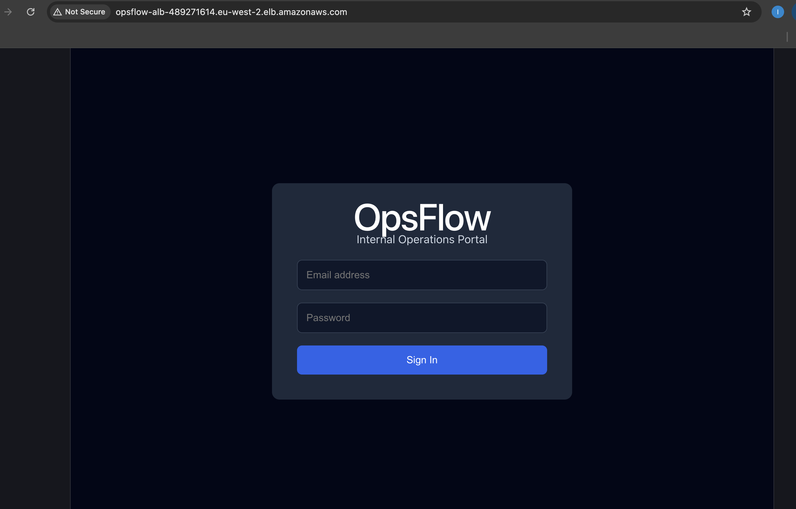
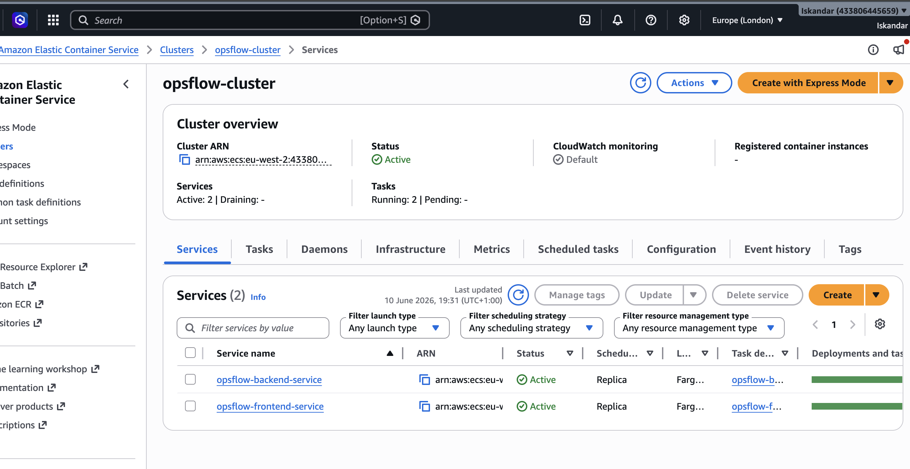
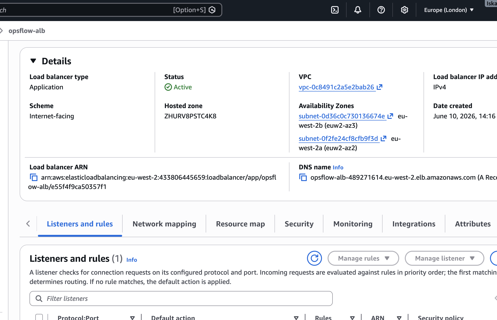
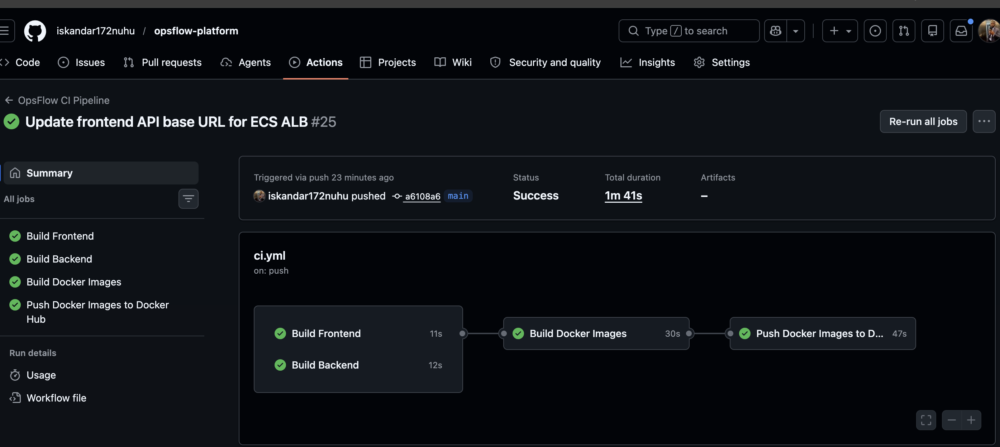
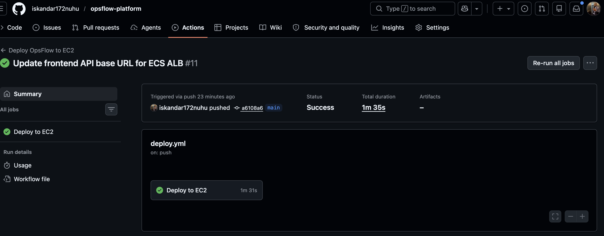
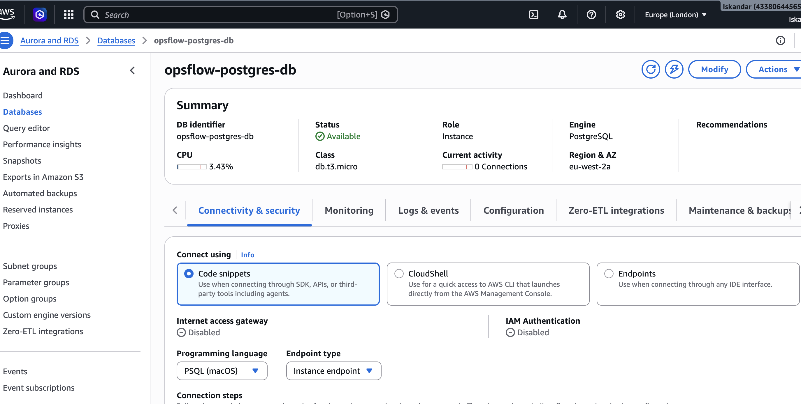
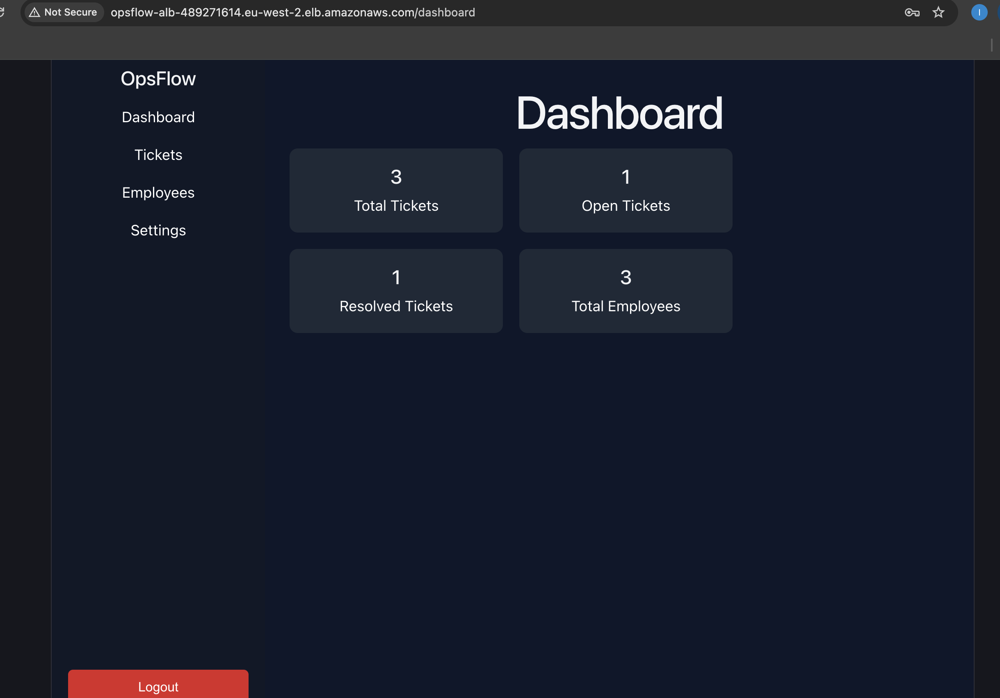

# OpsFlow Platform

Production-grade internal operations management platform deployed on AWS using Terraform, ECS, Docker, RDS, Application Load Balancer, and GitHub Actions CI/CD.

---

# Live Application

Frontend URL:

```text
http://opsflow-alb-489271614.eu-west-2.elb.amazonaws.com
```

---

# Project Overview

OpsFlow is a cloud-native operations platform designed to simulate a real-world enterprise internal management system.

The project demonstrates end-to-end DevOps engineering practices including:

* Infrastructure as Code
* Container orchestration
* CI/CD automation
* Production networking
* Load balancing
* Secure API integration
* Persistent database deployment
* AWS cloud infrastructure management

The platform consists of:

* React frontend
* Node.js/Express backend
* PostgreSQL database
* ECS container services
* Application Load Balancer
* Terraform-managed AWS infrastructure
* Automated GitHub Actions deployments

---

# Architecture

## Architecture Diagram



## AWS Infrastructure Components

* VPC
* Public Subnets
* Internet Gateway
* Route Tables
* Security Groups
* ECS Cluster
* ECS Services
* ECS Task Definitions
* Application Load Balancer
* Target Groups
* Amazon RDS PostgreSQL
* Elastic IP
* GitHub Actions CI/CD
* Terraform Remote State

---

# Technology Stack

## Frontend

* React
* Axios
* Vite

## Backend

* Node.js
* Express.js
* PostgreSQL
* JWT Authentication
* bcrypt

## Cloud & DevOps

* AWS ECS
* AWS RDS
* AWS ALB
* Terraform
* Docker
* GitHub Actions
* NGINX

---

# Features

* User Authentication
* Employee Management
* Ticket Management
* JWT Authorization
* Persistent PostgreSQL Storage
* CI/CD Automation
* Containerized Application Deployment
* Infrastructure as Code
* Production Load Balancing
* ECS Service Orchestration

---

# Security Implementation

The platform includes production-oriented security controls and networking configurations.

## Security Controls

* JWT-based authentication
* Password hashing using bcrypt
* Environment variable configuration
* Protected API routes
* AWS Security Groups
* Internal database isolation
* ALB reverse proxy routing
* Express rate limiting
* Helmet security middleware
* ECS service separation
* Controlled database access within VPC

---

# Infrastructure Deployment

## Terraform Commands

### Initialize Terraform

```bash
terraform init
```

### Preview Infrastructure

```bash
terraform plan
```

### Deploy Infrastructure

```bash
terraform apply
```

### Destroy Infrastructure

```bash
terraform destroy
```

---

# CI/CD Pipeline

## Deployment Workflow

1. Developer pushes code to GitHub
2. GitHub Actions pipeline starts automatically
3. Docker containers are rebuilt
4. ECS services are redeployed
5. Application becomes available through ALB
6. Updated containers replace previous running tasks

---

# API Endpoints

## Register User

```http
POST /api/auth/register
```

## Login User

```http
POST /api/auth/login
```

---

# Production Issues Resolved

This project involved troubleshooting and resolving several real-world cloud engineering and DevOps issues.

## Issues Solved

* ECS deployment failures
* ALB health check failures
* RDS connectivity issues
* PostgreSQL authentication problems
* Frontend/backend integration issues
* Reverse proxy routing issues
* Security group misconfigurations
* ECS task replacement problems
* CI/CD deployment timeouts
* API proxy configuration errors
* Terraform infrastructure dependency conflicts

---

# Screenshots

## Frontend Login Page



---

## ECS Services



---

## Application Load Balancer



---

## GitHub Actions CI/CD




---

## RDS PostgreSQL Database



---

## Successful Authentication



---

# Future Improvements

* HTTPS with ACM
* Route53 custom domain
* ECS Auto Scaling
* AWS Secrets Manager integration
* CloudWatch monitoring dashboards
* WAF integration
* Blue/Green deployments
* Multi-environment deployment strategy
* Centralized logging
* Observability stack integration

---

# Author

## Iskandar Nuhu

Cloud & DevOps Engineer
